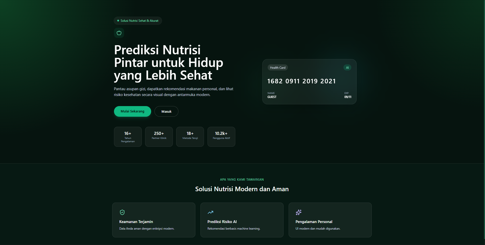
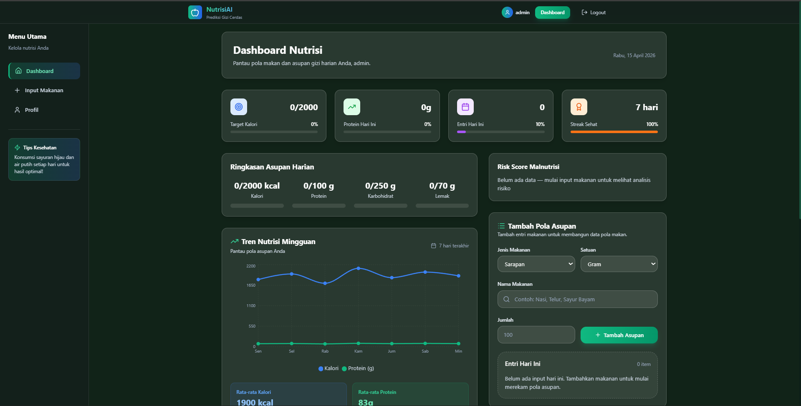

# NutriAI 🥗


*Landing page NutriAI*


*Dashboard ringkasan asupan nutrisi*

## Tentang Project
Aplikasi capstone NutriAI untuk membantu pengguna memantau asupan nutrisi dan mendapatkan rekomendasi makanan serta analisis risiko kesehatan.

## Fitur Utama
- Autentikasi user (register/login)
- Input makanan harian dengan data kalori, protein, karbohidrat, dan lemak
- Dashboard nutrisi dengan ringkasan asupan harian
- Prediction API untuk analisis risiko kesehatan
- Protected route dengan JWT authentication

## Struktur Project
```
capstone/
├── backend/           # FastAPI server
│   ├── main.py
│   ├── auth.py
│   ├── database.py
│   ├── models.py
│   ├── schemas.py
│   └── routers/
├── frontend/          # React + Vite app
│   ├── src/
│   ├── public/
│   └── package.json
├── docs/              # Dokumentasi tambahan
└── README.md
```

## Instalasi & Menjalankan Project

### Backend
```bash
cd backend
python -m venv venv
venv\Scripts\activate
pip install -r requirements.txt
uvicorn main:app --reload --host 0.0.0.0 --port 8000
```

### Frontend
```bash
cd frontend
npm install
npm run dev
```

Akses frontend: `http://localhost:5173`

## Endpoint API

### POST /auth/register
Request body:
```json
{
  "name": "Farel",
  "email": "farel@example.com",
  "password": "password123"
}
```

### POST /auth/login
Request body:
```json
{
  "email": "farel@example.com",
  "password": "password123"
}
```

### POST /food/
Body:
```json
{
  "meal_type": "breakfast",
  "food_name": "Nasi Goreng",
  "quantity": 200,
  "unit": "gram",
  "calories": 250,
  "protein": 8,
  "carbs": 35,
  "fat": 8
}
```

### POST /predict/
Body:
```json
{
  "quantity": 180,
  "age": 25,
  "weight": 65,
  "height": 170
}
```

## Bukti Pendukung
- Link GitHub repository
- Screenshot tampilan landing page dan dashboard
- Dokumentasi API di `docs/api.md`

## Tim
- Frontend: Farel Indra Syahputra
- Backend: Farel Indra Syahputra

---

**Catatan:** `README.md` berada di root repo sehingga GitHub akan menampilkan dokumentasi utama project.
