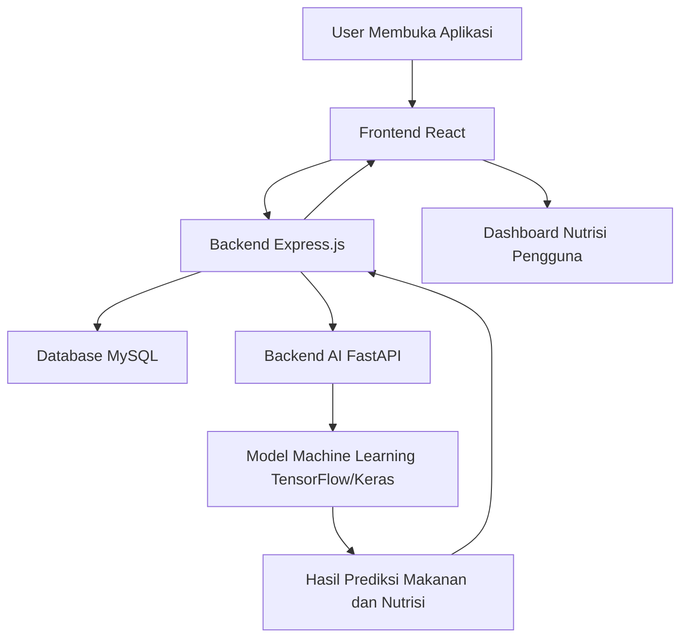

<div align="center">

# 🥗 NutriAI — Prediksi Nutrisi

### Sistem Prediksi Risiko Kekurangan Nutrisi Berbasis Pola Asupan Gizi Harian

<p>
  
  
  
  
  
</p>

<p>
  <b>NutriAI</b> adalah aplikasi berbasis web untuk membantu pengguna memantau asupan makanan harian, memprediksi nutrisi dari makanan, serta memberikan rekomendasi pola makan yang lebih sehat.
</p>

</div>

---

## 📌 Deskripsi Singkat Proyek

**NutriAI — Prediksi Nutrisi** merupakan aplikasi web yang dirancang untuk membantu pengguna dalam memantau pola konsumsi makanan harian dan memperkirakan kandungan nutrisi dari makanan yang dikonsumsi.

Aplikasi ini menggabungkan beberapa komponen utama, yaitu:

- **Frontend** untuk tampilan dashboard pengguna.
- **Backend Express.js** untuk autentikasi, pengelolaan data makanan, histori konsumsi, dan integrasi layanan.
- **Backend AI FastAPI** untuk menjalankan model Machine Learning.
- **Model Machine Learning TensorFlow/Keras** untuk melakukan prediksi makanan dari gambar.
- **Database MySQL** untuk menyimpan data pengguna, makanan, histori konsumsi, dan laporan prediksi.

Secara umum, sistem ini dapat digunakan untuk:

- Mencatat makanan yang dikonsumsi pengguna.
- Memprediksi makanan dari gambar.
- Mengestimasi kandungan nutrisi seperti kalori, protein, karbohidrat, dan lemak.
- Memberikan insight atau rekomendasi nutrisi berdasarkan data pengguna.
- Membantu pengguna memahami risiko pola makan yang kurang seimbang.

> ⚠️ Catatan: Hasil prediksi dan rekomendasi pada aplikasi ini bersifat edukatif dan estimasi, bukan pengganti konsultasi dengan dokter atau ahli gizi.

---

## 🧠 Alur Sistem


```mermaid
flowchart TD
    A[User Membuka Aplikasi] --> B[Frontend React]
    B --> C[Backend Express.js]
    C --> D[Database MySQL]
    C --> E[Backend AI FastAPI]
    E --> F[Model Machine Learning TensorFlow/Keras]
    F --> G[Hasil Prediksi Makanan dan Nutrisi]
    G --> C
    C --> B
    B --> H[Dashboard Nutrisi Pengguna]
```

---

## 🛠️ Tech Stack

| Bagian | Teknologi |
|---|---|
| Frontend | React, Vite, Tailwind CSS |
| Backend | Node.js, Express.js |
| AI Backend | Python, FastAPI |
| Machine Learning | TensorFlow, Keras |
| Database | MySQL |
| ORM | Sequelize |
| API Client | Axios |
| File Upload | Multer |
| Deployment | Railway / Docker |
| AI Recommendation | Google Gemini API |

---

## 📁 Struktur Repository

```bash
prediksi-nutrisi/
│
├── backend-ai/
│   ├── app/
│   ├── artifacts/
│   ├── main.py
│   ├── requirements.txt
│   └── README.md
│
├── backend/
│   ├── data/
│   ├── middleware/
│   ├── routers/
│   ├── services/
│   ├── static/
│   ├── index.js
│   ├── database-express.js
│   ├── models-express.js
│   ├── package.json
│   └── .env.example
│
├── frontend/
│   ├── src/
│   ├── public/
│   ├── package.json
│   └── server.cjs
│
├── docs/
├── Dockerfile
├── package.json
├── TODO.md
└── README.md
```

---

## ⚙️ Petunjuk Setup Environment

### 1. Clone Repository

```bash
git clone https://github.com/farelrunin/prediksi-nutrisi.git
cd prediksi-nutrisi
```

---

### 2. Persiapan Software

Pastikan perangkat sudah memiliki:

| Software | Versi yang Disarankan |
|---|---|
| Node.js | 20 atau lebih baru |
| npm | versi terbaru |
| Python | 3.10 atau lebih baru |
| MySQL | 8.0 atau lebih baru |
| Git | versi terbaru |

Cek versi dengan perintah:

```bash
node -v
npm -v
python --version
mysql --version
git --version
```

---

## 🔐 Konfigurasi Environment Backend Express

Masuk ke folder backend:

```bash
cd backend
```

Buat file `.env` berdasarkan `.env.example`:

```bash
cp .env.example .env
```

Untuk Windows PowerShell, bisa gunakan:

```powershell
Copy-Item .env.example .env
```

Isi file `.env` seperti berikut:

```env
PORT=5000

DATABASE_URL=mysql://root:@localhost:3306/nutriai_db

SECRET_KEY=your_secret_key_here

GEMINI_API_KEY=your_gemini_api_key_here

AI_MODEL_URL=http://localhost:8000
```

Keterangan:

| Variable | Fungsi |
|---|---|
| `PORT` | Port untuk backend Express.js |
| `DATABASE_URL` | URL koneksi database MySQL |
| `SECRET_KEY` | Secret key untuk autentikasi JWT |
| `GEMINI_API_KEY` | API key untuk layanan Gemini |
| `AI_MODEL_URL` | URL backend AI FastAPI |

> Jika menggunakan Railway MySQL, kamu juga bisa memakai variable seperti `MYSQLHOST`, `MYSQLUSER`, `MYSQLPASSWORD`, `MYSQLDATABASE`, dan `MYSQLPORT`.

---

## 🗄️ Setup Database MySQL

Masuk ke MySQL:

```bash
mysql -u root -p
```

Buat database:

```sql
CREATE DATABASE nutriai_db;
```

Keluar dari MySQL:

```sql
EXIT;
```

Backend akan melakukan sinkronisasi model database saat server dijalankan.

---

## 🤖 Tautan Model Machine Learning

Model Machine Learning tidak disimpan langsung di repository karena ukuran file biasanya besar.

Silakan unduh model melalui tautan berikut:

```text
link model(asna)
```

---

## 📓 Notebook Machine Learning

Proses pengembangan model Machine Learning pada aplikasi ini didokumentasikan secara terpisah dalam repository berikut:

```text
https://github.com/asnalaia/NutriAi-ML.git
```

---

## 📥 Cara Menyimpan Model ML

Setelah model diunduh, simpan file model ke folder berikut:

```bash
backend-ai/artifacts/
```

Nama file model yang digunakan:

```bash
best_nutrivision_cnn_food101_akg.keras
```

Struktur yang benar:

```bash
backend-ai/
└── artifacts/
    ├── best_nutrivision_cnn_food101_akg.keras
    ├── class_names.json
    └── nutrition_table_cleaned.csv
```

Pastikan file berikut tersedia:

| File | Fungsi |
|---|---|
| `best_nutrivision_cnn_food101_akg.keras` | Model Machine Learning utama |
| `class_names.json` | Daftar kelas makanan |
| `nutrition_table_cleaned.csv` | Data referensi nutrisi makanan |

---

## 🧩 Cara Load Model ML

Model akan dimuat secara otomatis oleh backend AI FastAPI dari path berikut:

```bash
backend-ai/artifacts/best_nutrivision_cnn_food101_akg.keras
```

Jika ingin mengubah nama atau lokasi model, sesuaikan path pada file service model di backend AI.

Contoh konsep load model:

```python
import keras

model = keras.models.load_model(
    "artifacts/best_nutrivision_cnn_food101_akg.keras",
    compile=False,
    safe_mode=False
)
```

---

# ▶️ Cara Menjalankan Aplikasi

Aplikasi ini terdiri dari 3 bagian utama yang dijalankan secara terpisah:

1. Backend AI FastAPI
2. Backend Express.js
3. Frontend React/Vite

---

## 1. Menjalankan Backend AI FastAPI

Masuk ke folder `backend-ai`:

```bash
cd backend-ai
```

Buat virtual environment:

```bash
python -m venv venv
```

Aktifkan virtual environment.

Untuk Windows PowerShell:

```powershell
venv\Scripts\activate
```

Untuk Linux/macOS:

```bash
source venv/bin/activate
```

Install dependency Python:

```bash
pip install -r requirements.txt
```

Jalankan backend AI:

```bash
python main.py
```

Atau bisa juga menggunakan Uvicorn:

```bash
uvicorn app.main:app --reload --host 0.0.0.0 --port 8000
```

Backend AI akan berjalan di:

```text
http://localhost:8000
```

Dokumentasi API FastAPI dapat dibuka di:

```text
http://localhost:8000/docs
```

Endpoint prediksi AI:

```http
POST /predict
```

atau:

```http
POST /api/predict
```

---

## 2. Menjalankan Backend Express.js

Buka terminal baru, lalu masuk ke folder backend:

```bash
cd backend
```

Install dependency:

```bash
npm install
```

Jalankan backend:

```bash
npm start
```

Backend Express akan berjalan di:

```text
http://localhost:5000
```

Endpoint utama backend:

```http
GET /
```

Endpoint prediksi teks makanan:

```http
POST /predict
```

Endpoint prediksi gambar:

```http
POST /predict/predict-image
```

Endpoint rekomendasi:

```http
POST /predict/recommendations
```

---

## 3. Menjalankan Frontend React/Vite

Buka terminal baru, lalu masuk ke folder frontend:

```bash
cd frontend
```

Install dependency:

```bash
npm install
```

Jalankan frontend:

```bash
npm run dev
```

Frontend akan berjalan di:

```text
http://localhost:5173
```

---

## 🚀 Menjalankan Semua Komponen Secara Ringkas

Gunakan 3 terminal berbeda:

### Terminal 1 — Backend AI

```bash
cd backend-ai
venv\Scripts\activate
uvicorn app.main:app --reload --host 0.0.0.0 --port 8000
```

### Terminal 2 — Backend Express

```bash
cd backend
npm install
npm start
```

### Terminal 3 — Frontend

```bash
cd frontend
npm install
npm run dev
```

---

## 🧪 Contoh Request Prediksi Gambar

Gunakan endpoint backend Express:

```http
POST http://localhost:5000/predict/predict-image
```

Form-data:

| Key | Type | Value |
|---|---|---|
| `image` | File | gambar makanan |

Contoh menggunakan cURL:

```bash
curl -X POST "http://localhost:5000/predict/predict-image" \
  -F "image=@sample-food.jpg"
```

---

## 📤 Contoh Response Prediksi

```json
{
  "risk_level": "Low",
  "score": 0.2,
  "suggestion": "Pola makan cukup seimbang",
  "ai_advice": "Makanan terdeteksi: Nasi Goreng. Mengandung sekitar 350 kalori.",
  "food_name": "Nasi Goreng",
  "confidence": 0.95,
  "confidence_persen": 95.0,
  "calories": 350,
  "protein": 7,
  "carbs": 45,
  "fat": 15,
  "quantity_grams": 100
}
```

---

## 🐳 Menjalankan dengan Docker

Repository ini menyediakan `Dockerfile` untuk menjalankan service berdasarkan variable `SERVICE_TYPE`.

Build image:

```bash
docker build -t nutriai-app .
```

Menjalankan backend:

```bash
docker run -p 5000:5000 -e SERVICE_TYPE=backend nutriai-app
```

Menjalankan frontend:

```bash
docker run -p 5173:5173 -e SERVICE_TYPE=frontend nutriai-app
```

---

## 📌 Fitur Utama

- Login dan register pengguna.
- Dashboard pemantauan nutrisi.
- Input makanan harian.
- Prediksi makanan dari gambar.
- Estimasi kalori dan makronutrien.
- Histori konsumsi makanan.
- Rekomendasi menu atau saran nutrisi.
- Integrasi backend Express dengan backend AI FastAPI.
- Penyimpanan data menggunakan MySQL.
- Dukungan deployment menggunakan Railway atau Docker.

---

## 🔒 Catatan Keamanan

Beberapa hal yang perlu diperhatikan sebelum deployment:

- Jangan upload file `.env` ke GitHub.
- Jangan menyimpan API key langsung di dalam source code.
- Gunakan secret key yang kuat untuk JWT.
- Pastikan database production menggunakan password.
- Gunakan HTTPS ketika aplikasi sudah dideploy.
- Batasi ukuran upload gambar agar server tidak terbebani.
- Validasi input pengguna pada sisi frontend dan backend.

---

## ⚠️ Disclaimer

Aplikasi ini dibuat untuk tujuan edukasi dan pengembangan sistem berbasis Machine Learning.

Hasil prediksi makanan, estimasi nutrisi, dan rekomendasi yang diberikan oleh sistem bersifat estimasi. Aplikasi ini tidak dimaksudkan untuk memberikan diagnosis medis atau menggantikan konsultasi dengan dokter, ahli gizi, atau tenaga kesehatan profesional.

---

## 👥 Tim Pengembang

| Role | Tugas |
|---|---|
| Frontend Developer | Membuat tampilan dashboard dan interaksi pengguna |
| Backend Developer | Mengelola API, autentikasi, database, dan integrasi service |
| Machine Learning Engineer | Membuat dan mengintegrasikan model prediksi makanan |
| Cloud/Deployment | Menyiapkan deployment aplikasi |

---

<div align="center">

## 🥗 NutriAI

**Smart Nutrition Prediction System for Better Daily Eating Awareness**

Made with React, Express.js, FastAPI, TensorFlow, and MySQL.

</div>
